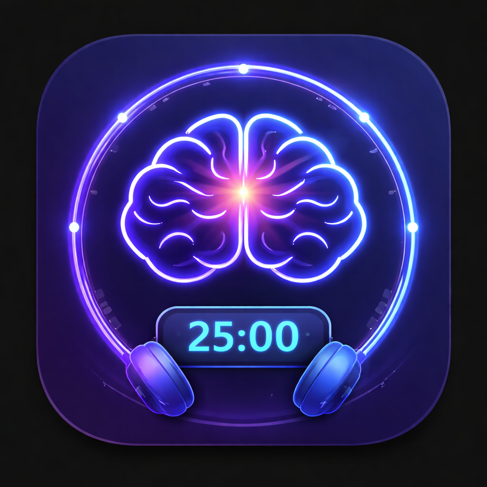

# 🎯 FlowState - Deep Focus Timer

<p align="center">
  
</p>

<p align="center">
  <strong>A beautiful floating focus timer with binaural beats, ambient sounds, and gamification.</strong>
</p>

<p align="center">
  <a href="#features">Features</a> •
  <a href="#download">Download</a> •
  <a href="#web-app">Web App</a> •
  <a href="#development">Development</a>
</p>

---

## ✨ Features

| Feature | Description |
|---------|-------------|
| 🧠 **Binaural Beats** | Scientifically-proven audio frequencies for enhanced focus (Alpha, Beta, Theta waves) |
| 📌 **Always-On-Top Widget** | Floating timer that stays visible while you work in VS Code, Chrome, or any app |
| 🎵 **Ambient Sounds** | Rain, fireplace, forest, and ocean waves to create your perfect environment |
| ⭐ **XP & Levels** | Earn XP for every session, level up, and track your progress |
| 🔥 **Streak System** | Build daily streaks to stay consistent and motivated |
| 🏆 **Achievements** | Unlock 12 achievements for completing focus milestones |
| 🎯 **Daily Challenges** | New challenge every day for bonus XP |
| 🖥️ **4 Widget Modes** | Mini, Compact, Landscape, and Full - perfect for competitive programming |
| 🫥 **Transparency Control** | Adjustable opacity so you can see through the widget while coding |
| 📍 **Snap to Corners** | Double-click to snap widget to screen corners |

## 🎮 Widget Modes

Perfect for **Codeforces**, **LeetCode**, and competitive programming:

| Mode | Size | Best For |
|------|------|----------|
| ▪ **Mini** | 150×155px | Maximum screen space, just timer |
| ◻ **Compact** | 200×280px | Balanced view with presets |
| ▬ **Landscape** | 340×110px | Horizontal bar, ideal for top/bottom |
| ▣ **Full** | 280×520px | All features visible |

### Keyboard Shortcuts
- `1` `2` `3` `4` - Switch widget modes
- `Space` - Start/Pause timer
- `R` - Reset timer  
- `T` - Toggle transparency

## 📸 Screenshots

### Desktop Widget (Always-On-Top)
The widget floats above all your windows while you code:

```
┌─────────────────────┐
│ ● ● ●   FlowState   │
├─────────────────────┤
│   ⭐ Lvl 7   🔥 5   │
│                     │
│      ╭─────╮        │
│     │ 18:42 │       │
│      ╰─────╯        │
│                     │
│  🌧️  🔥  🌲  🌊    │
│  ━━━━━━━━○━━━━━━━  │
│                     │
│   [ ⏸ Focusing ]   │
└─────────────────────┘
```

## ⬇️ Download

### Windows Desktop App
Download the installer from [GitHub Releases](../../releases/latest):

**[⬇️ Download FlowState Setup (Windows)](../../releases/latest/download/FlowState-Setup-1.0.0.exe)**

> ⚠️ **Windows SmartScreen:** Since we're a new app, Windows may show a warning. Click "More info" → "Run anyway" to install.

### Requirements
- Windows 10/11 (64-bit)
- ~80 MB disk space
- Headphones recommended for binaural beats

## 🌐 Web App

Don't want to install? Try the web version:

**[🚀 Open Web App](https://flowstate.vercel.app)**

The web app has all features except the always-on-top floating widget.

## 🎧 How Binaural Beats Work

Binaural beats are created when two slightly different frequencies are played in each ear:

| Mode | Frequency | Effect |
|------|-----------|--------|
| ⚡ Focus | 10 Hz (Alpha) | Enhanced concentration and alertness |
| 🚀 Deep Work | 16 Hz (Beta) | Peak cognitive performance |
| 🌊 Chill | 6 Hz (Theta) | Relaxed, creative thinking |

**Important:** Use headphones! Binaural beats require different frequencies in each ear to work.

## 🛠️ Development

### Prerequisites
- Node.js 18+
- npm or yarn

### Setup

```bash
# Clone the repository
git clone https://github.com/ManojSwagath/flowstate.git
cd flowstate

# Install dependencies
npm install

# Run the desktop app
npm start

# Build Windows installer
npm run build:win
```

### Project Structure

```
flowstate/
├── main.js          # Electron main process
├── widget.html      # Floating widget UI
├── index.html       # Full web app
├── style.css        # Web app styles
├── script.js        # Web app logic
├── landing.html     # Landing/download page
├── icon.png         # App icon
└── package.json     # Dependencies & build config
```

## 🤝 Contributing

Contributions are welcome! Feel free to:

1. 🐛 Report bugs
2. 💡 Suggest features
3. 🔧 Submit pull requests

## 📄 License

MIT License - feel free to use this project however you like!

## 💜 Made By

Created by **Manoj Swagath** with love for deep work enthusiasts.

---

<p align="center">
  <strong>Stay focused. Level up. 🚀</strong>
</p>
